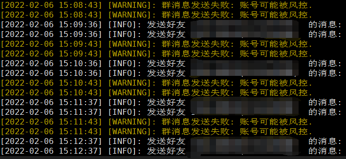

# 提醒

由于 QQ 机器人经常挂掉，有时候重登都登不上，你可以查看另一个不使用 QQ 机器人的脚本：

https://github.com/xuejianxianzun/bilibili-live-notify

上面的脚本不需要折腾 QQ 机器人，配置也更简单。

---------------

# Bilibili 直播推送到 QQ 消息

这是一个 Nodejs 脚本，通过 Bilibili 的 API 获取直播间状态，并且当状态变化时在 QQ 上进行通知（通过 QQ 机器人）。

你可以设置：
- 要监控的直播间
- 发送到哪个 QQ 群和（或） QQ 号
- 发送的消息文本
- 是否发送直播间封面图（默认发送）

效果图：


**注意：**如果你的 QQ 机器人处于被风控的状态，可能无法发送群消息。

# 运行环境

1. 需要 Nodejs 环境
2. 需要配置 go-cqhttp

**go-cqhttp 是一个 QQ 机器人框架，本脚本通过它向 QQ 发送消息。** [访问 go-cqhttp 主页](https://github.com/Mrs4s/go-cqhttp)

# 使用步骤

## 配置

下载 `live-push-qq.js`，并在其中配置你需要监控的直播间。

如果你需要监控多个直播间，可以复制数组里的配置项，添加多个直播间。

```js
// 以直播间为单位进行配置
// 消息里可以使用的转义代码：
// {name} {title} {room_id}
const room_list = [
  {
    room_id: 23251345,  // 直播间 id
    name: '主播名字或昵称', // 主播名字或昵称
    status: 0,  // 直播状态，不需要用户修改
    cover: '',  // 封面图，不需要用户修改
    send_cover: true, // 是否发送直播间封面图片
    title: '', // 直播间标题，不需要用户修改
    interval: 60000,  // 多久查询一次直播状态（毫秒）。默认 1 分钟查询一次
    qq_group: 123456789, // 发送消息到哪个 QQ 群里。设置为 0 则不发送。（不会 @全体成员）
    // 如果需要更复杂的 qq 群消息设置，例如发送到多个群，或者（并且）需要 @全体成员，则可以把上面的 qq_group 设置为 0
    // 然后在下面的 qq_group_list 里设置群号和是否 @全体成员
    // qq_group_list 不使用时可以为空数组，也可以删除该属性
    qq_group_list: [
      {
        id: 1111111,
        at_all: true,
      },
      {
        id: 222222,
        at_all: false,
      },
    ],
    qq_person: 111111111, // 发送消息到哪个 QQ 号上（即私聊）。设置为 0 则不发送。如果需要发送，建议先加好友，不知道对陌生人能不能发送
    msg: [             // 当直播状态变化时要发送的提醒消息
      '{name}尚未开播', // 0 尚未开播的提醒消息
      '{name}正在直播：{title} https://live.bilibili.com/{room_id}', // 1 正在直播的提醒消息
      '{name}正在轮播'  // 2 轮播的提醒消息
    ],
  },
]
```

## 启动

之后启动这个脚本：

```shell
# 使用 node 启动
node live-push-qq.js

# 或者使用守护进程来启动，例如：
forever start live-push-qq.js
```

# 提醒

## 默认只有开播会发送消息

代码里的函数 `sendMsg` 用于发送提醒消息。

默认只有当主播开播时才会发送消息，如果你需要在下播时也发送消息，可以启用被注释掉的 `sendMsg` 调用。

## QQ 小号被风控的问题

使用 go-cqhttp 给 QQ 群发送太多消息可能会被腾讯风控，期间无法发送群消息（但是给 QQ 号发消息一般不会有事）。

如图：



以下措施有助于缓解或解决风控问题：

- 减少发送群消息的数量、频次、字数
- 不发送封面图片，只发纯文字消息
- 删除文件 `session.token`，然后重新启动 go-cqhttp 进行登录
- go-cqhttp 上登录的 QQ 号多挂几天，也许就好了
